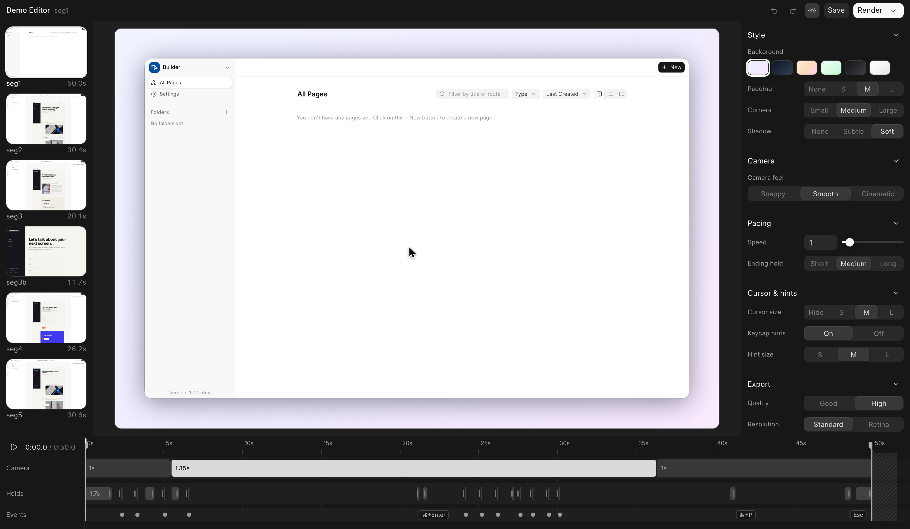
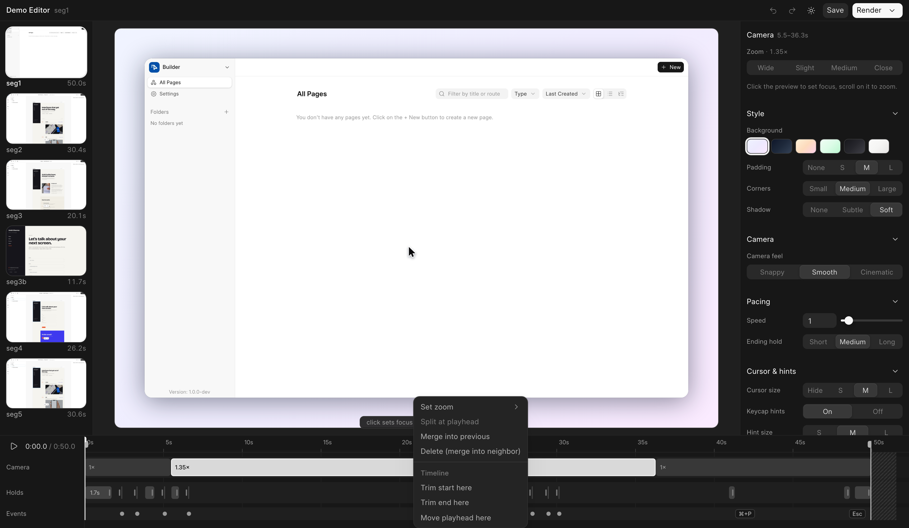

# demo-video

A [Claude Code skill](https://code.claude.com/docs/en/skills) that produces polished, ScreenStudio-style 60fps product demo videos of any web app, with a tiny dependency-light pipeline: Playwright frame capture plus a multiprocess Pillow compositor streaming straight into ffmpeg. No screen recorder, no Node, no Remotion.

The trick: instead of recording in real time, a Playwright script drives the app one small step per frame and screenshots each one. Capture can take minutes of wall-clock; playback is still perfect 60fps. A virtual camera (focus point + zoom per frame) lives in the compositor, so re-framing or re-pacing a video is a re-render, not a re-shoot.

The compositor adds the "ScreenStudio look": gradient background, rounded panel with soft shadow, a crisp vector cursor, click pulse rings, and smooth eased zoom/pan. `HD=1` re-renders the same capture at retina resolution.

Takes don't have to be scripted: a bundled Chrome extension records the current tab by hand into the exact same pipeline — cursor-free frames, an auto-framed camera derived from your clicks, and full editability afterwards.

## What it produces

A fully scripted storyline: chip toggles with click pulse rings, per-frame typing, a submit spinner, and an animated success state. Runs against a [self-contained fixture page](examples/feedback-form), so you can reproduce it locally with `VIDEO_DIR=/abs/workdir python examples/feedback-form/capture.py`:


https://github.com/user-attachments/assets/c242145c-ecb9-4edc-9891-8852d5e1a8fa


The multi-case "tile" pattern from `example-multicase.py`, showcasing five drag-reorder behaviors of [Frappe Builder](https://github.com/frappe/builder) in one take:


https://github.com/user-attachments/assets/d1ae9ce6-27a1-4517-80f8-65e37682e152


## Install

```sh
git clone https://github.com/surajshetty3416/demo-video-skill ~/.claude/skills/demo-video
```

Then ask Claude Code to "make a demo video of ..." and it picks the skill up automatically. It will ask you up front for the app URL, test login, and what flow to show, so have a dev server and a throwaway account handy.

## Requirements

- Python 3.10+ with `pillow` and `playwright` (`pip install pillow playwright && playwright install chromium`)
- `ffmpeg` on PATH
- Optional: `tkinter` for the floating REC pill shown during hand-recorded takes

## What's inside

| File | Purpose |
| --- | --- |
| `SKILL.md` | The skill itself: pipeline, cinematography principles, gotchas |
| `capture_template.py` | Copy-and-edit Playwright capture harness (camera + mouse timeline) |
| `compositor.py` | Multiprocess Pillow renderer, streams frames into one ffmpeg process |
| `example-multicase.py` | Complete working example of the multi-case "tile" pattern |
| `examples/feedback-form/` | Self-contained runnable demo (fixture page + capture script), no app server needed |
| `editor/` | Local web editor for interactive fine-tuning: timeline, camera blocks, holds, speed regions, re-render |
| `extension/` | Chrome extension for hand-recorded takes: streams tab frames + input events to the editor server |
| `ingest.py` | Converts a hand recording into the standard capture bundle (60fps grid, still-collapse, auto-framing) |

## Interactive editor

`python3 editor/server.py <workdir>` opens a ScreenStudio-style web editor on a capture (stdlib http server + a prebuilt Vue UI, so no Node needed at run time): a live preview that replicates the compositor exactly, a scrubbable timeline with camera blocks, stretchable holds, speed regions and event chips, preset-first inspector panels, and one-click re-render + concat across segments. Edits are saved to `meta.edited.json` next to the capture; the original `meta.json` is never touched.

Add `--detach` to run the server in its own session: it prints the URL + pid and logs to `<workdir>/editor.log`. That keeps it alive when launched from an agent shell, where plain background tasks get reaped when the session's task manager stops them. `--port N` pins the port (handy for the recording extension), and the segment rail picks up newly imported takes without a reload.



Right-click anywhere on the timeline for context actions — camera zoom stops, split/merge, trims, holds, speed regions — all undoable with ⌘Z:



## Record by hand (Chrome extension)

For takes a human should drive, load `extension/` as an unpacked Chrome extension and start the editor server with a pinned port (`python3 editor/server.py --detach --port 8787 <workdir>` — the workdir may start empty). One click records the current tab:

- Capture goes through CDP screencast, so the frames carry **no OS cursor** — the compositor draws its crisp vector cursor from a logged input timeline, and cursor size/visibility stay editable after the fact.
- Clicks become pulse rings, modifier shortcuts become keycap hints, and the camera comes out **pre-framed from your click clusters** (zoom in a beat before a click, hold through the action, release after) — reshape or flatten any of it in the editor.
- Frames and events **stream to the server while you record**, so stopping is near-instant and memory stays flat; idle stretches cost nothing.
- A small always-on-top REC pill shows a timer and stops the take; being a separate OS window, it never appears in the recording. When a take lands, it shows up in the editor rail automatically.

Deterministic Playwright capture is still the tool for perfectly repeatable takes; the extension covers everything that's easier to just do by hand. Setup and details: [`extension/README.md`](extension/README.md).

## Using it without Claude Code

The scripts are plain Python and stand alone:

1. Copy `capture_template.py` and `compositor.py` next to a scratch workdir.
2. Edit the CONFIG block (`BASE`, `START_URL`, `VIEWPORT`) and write your storyline with the harness verbs (`move_to`, `cam`, `hold`, `still`, `fit_zoom`).
3. `VIDEO_DIR=/abs/workdir python capture_template.py`
4. `python compositor.py /abs/workdir` produces `demo.mp4` (`HD=1` for retina).

`SKILL.md` documents the harness verbs, the compositor knobs, and the cinematography rules that took real iteration to get right (decouple the camera from the cursor, zoom once per shot, `still()` vs `hold()`, drag-threshold gotchas, zoom headroom vs capture resolution).

## License

MIT
