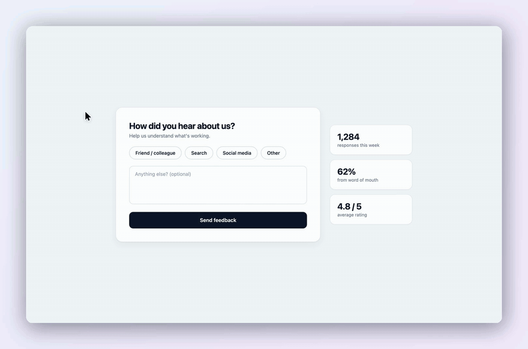

# demo-video

A [Claude Code skill](https://code.claude.com/docs/en/skills) that produces polished, ScreenStudio-style 60fps product demo videos of any web app, with a tiny dependency-light pipeline: Playwright frame capture plus a multiprocess Pillow compositor streaming straight into ffmpeg. No screen recorder, no Node, no Remotion.

The trick: instead of recording in real time, a Playwright script drives the app one small step per frame and screenshots each one. Capture can take minutes of wall-clock; playback is still perfect 60fps. A virtual camera (focus point + zoom per frame) lives in the compositor, so re-framing or re-pacing a video is a re-render, not a re-shoot.

The compositor adds the "ScreenStudio look": gradient background, rounded panel with soft shadow, a crisp vector cursor, click pulse rings, and smooth eased zoom/pan. `HD=1` re-renders the same capture at retina resolution.

## What it produces

A short storyline against a simple form page:



The multi-case "tile" pattern from `example-multicase.py`, showcasing five drag-reorder behaviors of [Frappe Builder](https://github.com/frappe/builder) in one take:


The GIFs above are downscaled 25fps previews. The real output is 60fps H.264: [feedback-form.mp4](media/feedback-form.mp4), [canvas-reorder.mp4](media/canvas-reorder.mp4) (download to play, GitHub does not inline-play committed videos).

## Install

```sh
git clone https://github.com/surajshetty3416/demo-video-skill ~/.claude/skills/demo-video
```

Then ask Claude Code to "make a demo video of ..." and it picks the skill up automatically.

## Requirements

- Python 3.10+ with `pillow` and `playwright` (`pip install pillow playwright && playwright install chromium`)
- `ffmpeg` on PATH

## What's inside

| File | Purpose |
| --- | --- |
| `SKILL.md` | The skill itself: pipeline, cinematography principles, gotchas |
| `capture_template.py` | Copy-and-edit Playwright capture harness (camera + mouse timeline) |
| `compositor.py` | Multiprocess Pillow renderer, streams frames into one ffmpeg process |
| `example-multicase.py` | Complete working example of the multi-case "tile" pattern |

## Using it without Claude Code

The scripts are plain Python and stand alone:

1. Copy `capture_template.py` and `compositor.py` next to a scratch workdir.
2. Edit the CONFIG block (`BASE`, `START_URL`, `VIEWPORT`) and write your storyline with the harness verbs (`move_to`, `cam`, `hold`, `still`, `fit_zoom`).
3. `VIDEO_DIR=/abs/workdir python capture_template.py`
4. `python compositor.py /abs/workdir` produces `demo.mp4` (`HD=1` for retina).

`SKILL.md` documents the harness verbs, the compositor knobs, and the cinematography rules that took real iteration to get right (decouple the camera from the cursor, zoom once per shot, `still()` vs `hold()`, drag-threshold gotchas, zoom headroom vs capture resolution).

## License

MIT
